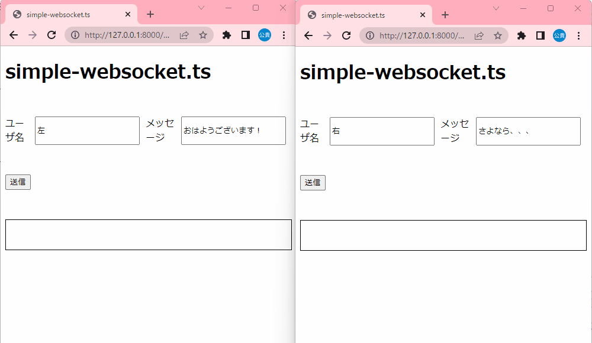

# simple-websocket.ts

TypeScriptを使用したWebSocketプログラムのサンプル。  

  

## 参考資料

- [TypeScript](https://typescript-jp.gitbook.io/deep-dive/nodejs)
- [websocket GitHub](https://github.com/websockets/ws)
- [websocket MDN](https://developer.mozilla.org/en-US/docs/Web/API/WebSocket)
